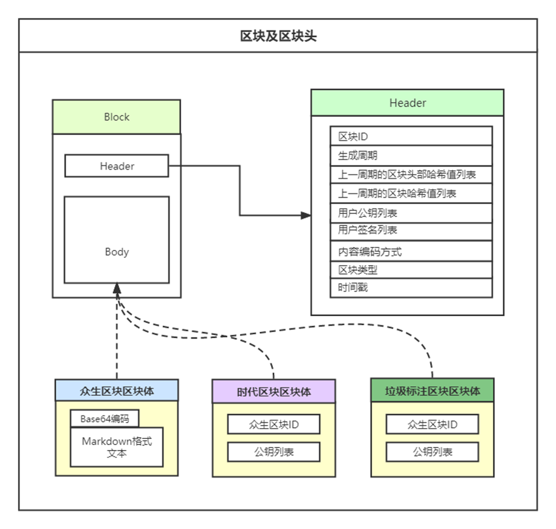

# 众生之链

## 简介

众生之链是一款用来永久记录“生命”的区块链系统。这里记录的“生命”可以是自己的亲人、朋友；可以是自己印象深刻的文学人物或影像人物；可以是曾经拥有我们共同记忆的艺术家；可以是值得时代记忆的历史人物等等。该系统上线后由社区共同维护和更新，数据保存在全网，以此在人类社会中永久保留。

## 系统特性

### 面向多场景用户的开源系统架构
为了使普通用户无门槛、一般技术用户低门槛、高级技术用户高自由度地参与众生之链项目，众生之链系统采用面向多场景用户的开源系统架构，将众生之链系统总体分为四个层次，基础层、核心层、服务层和展示层，并在Github上开放源代码。其中基础层提供了项目必备的运行环境，可通过Docker容器技术快速部署；核心层和服务层之间通过彼此提供的SDK进行数据交互，两层均具备独立的运行逻辑；展示层通过调用服务层提供的API进行数据交互。

为了在保障低门槛的基础上，不降低众生之链系统的灵活性，对于不同场景、不同技术用户的，本系统提供了不同的参与方式。

**无技术的普通用户**若想参与众生之链项目，无需学习任何技术，也无需部署系统，可以直接在主节点提供的前端页面上记录生命、参与投票等；**一般技术用户**若想参与众生之链项目，可以将众生之链系统部署到服务器，完成节点的数据同步，申请成为主节点，并向普通用户提供在线服务；**高级技术用户**若想共同设计或优化众生之链项目，可以在遵守设计规范的基础上，递进式地优化众生之链系统的展示层、服务层和核心层，每层之间仍会具备较低的耦合性。除此之外，如果**任何用户**认为共识机制存在缺陷或漏洞，可通过在开源社区发表见解，共同优化共识机制。

### 去中心化的存储和验证方案
区别于传统数据存储解决方案，本系统采用基于密码共识机制的区块链存储方案。在该区块链存储方案下，每个遵守共识机制的主机都将存储一份数据，且彼此之间通过共识机制互相验证数据的真实性和有效性。相对于目前市场内的桌面级、企业级存储和云存储，众生之链系统采用的去中心化区块链存储方案具有更高的可靠性、更高的服务可用性、更低的成本。

在可靠性方面，众生之链系统通过将数据存储在所有去中心化节点中，有效避免了单点故障带来的负面影响。在服务可用性方面，众生之链系统通过把负载分散到各地的节点上，用户可以使用任何众生之链主节点提供的服务，既降低单个节点的计算、并发压力，又提高了服务用户的效率。在成本方面，相对于借助大型服务器建立的企业级冗余存储机制，众生之链系统的单个存储节点的建设成本要低得多。

### 密钥对体系下的用户管理
综合考虑到加密的安全和性能，本系统使用NIST P-384椭圆曲线算法作为众生之链系统的密钥对体系的密码学基础。NSA Suite B Cryptography是美国国家安全局颁布的一套密码算法，是其密码现代化计划的一部分。NIST P-384是当前在NSA Suite B Cryptography中为ECDSA和ECDH算法指定的椭圆曲线，它是一个 384 位的曲线。

本系统通过公钥标识用户身份和验证用户签名，通过私钥生成签名。在密钥对体系下的用户管理体系中，无需中心服务器提供身份管理服务，所有主节点的用户不再互相隔绝，而是一个整体，共同生成或修改数据，所有规则和奖惩方案公开透明。

在密钥对体系下的用户管理体系下，单独个人、组织或某小部分人无法控制众生之链系统的运行，也无法对用户进行任何在共识机制之外的限制。在安全方面，由椭圆曲线密码学背书，从数学底层原理上保证密钥对体系的安全性，在众生之链系统中的任何成员都无法更改他人的数据或密钥对。

### 授权共识机制
在众生之链系统的应用场景下，由于存储的数据本身具有实际的直接价值，故用户生成区块本身就是一种激励机制，用户生成区块的目的就是为了记录“生命”。为了鼓励用户高质量的记录“生命”的同时，减少不符合社区规范的区块的产生，甚至删除恶意产生的区块，本文提出了结合区块推荐、区块标识和投票的授权共识机制。

针对区块链系统中各节点间多方互信问题和女巫问题，本文提出采用授权加入的方法，只有经过授权共识机制验证的节点，才能加入授权网络，才能成为主节点，进而拥有众生之链系统中各种类型区块的读写权限，没有经过授权共识机制验证的节点仅有区块的读权限。


## 社区规范&概念（试行）

众生之类系统有三种类型的区块，众生区块、时代区块和垃圾标注区块，每种类型的区块都由区块头部和区块体构成。

众生区块用来记录人们认为值得的，并且已经“离去”的“生命”。众生区块的区块体以Markdown格式渲染，并且以Base64编码后存储。

时代区块是建立在众生区块基础之上，用来记录一个或多个群体的人们认为值得的，并且已经离去的“生命”。时代区块的区块体存储众生区块的区块ID和对应的普通用户公钥、主节点用户公钥。

垃圾标注区块和时代区块的运作方式类似，同样是建立在众生区块的基础之上，但是设立他们的目的不同。区块链系统的底层原理决定了数据一旦被写入区块链，就难以修改。为了保证区块链难以篡改特性的同时，又可以在一定情况下修改区块链，本系统设计了垃圾标注区块，并且建立了垃圾标注机制，以便能够删除主节点用户错误生成，或恶意生成的不符合社区规范的众生区块。若某一众生区块被标注为垃圾区块，则任何结点无需再保存该区块的区块体内容。




### 众生区块

众生区块用来记录一切已经离去的“生命”，他们将在此永久留存。


### 时代区块

如果众生区块记录的某个“生命”属于我们这个年代许多人的的共同记忆，那么，主节点用户可以推荐该众生区块，之后，我们大家一起投票，使他成为时代区块，他不该被忘记。

### 垃圾区块

为了能够删除主节点用户错误生成的不符合社区规范的众生区块，我们提出了垃圾区块标注机制。

社区成员一起投票表决标注垃圾区块，若某一众生区块被标注为垃圾区块，则任何结点无需再保存该区块的区块体内容。

### 主节点用户

主节点用户作为众生之链的联盟成员，有责任和义务推动众生之链社区的发展和维护系统的稳定。 主节点的加入采用申请制度，超过半数以上的主节点同意才可成为主节点。 主节点用户有以下权限：

1. 挑选普通用户提交的优秀"生命"记录，并将其作为区块体生成众生区块。
2. 挑选优秀众生区块，并推荐为时代区块。
3. 审阅不符合社区规范的众生区块，并将其标注垃圾区块。
4. 发起投票

主节点用户有以下责任和义务：

1. 保证24小时不间端运行。
2. 提供普通用户可以记录“生命”的平台。
3. 维护时代区块和垃圾标注区块。
4. 审阅其他结点提交的成为主节点的申请书。
5. 监督其他主节点。
6. 计算投票数据并授权给有贡献的普通用户。

### 普通用户

普通用户有以下权利

1. 记录“生命”。
2. 投票选举，使众生区块成为时代区块。
3. 投票标记，使众生区块被标记为垃圾区块。
4. 申请成为主节点。

## 共识机制

查看[共识机制 ](./consensus_mechanism.md)

## P2P网络设计

众生之链系统各节点的核心层采用对等互联网络技术（简称P2P）网络进行通信。P2P网络模块涉及到的子模块有网络发现、身份验证、订阅者、发布者、发送端和服务端。

当节点首次接入众生之链授权网络时，由于没有其他主节点的IP地址，节点无法与任何活跃的主节点进行通信。为了发现一些主节点的IP地址，本文提出了两种方法，IP种子和手动指定。IP种子是硬编码到众生之链系统中的域名，提供一些活跃节点的IP地址，通过这些IP地址，可以获取到整个授权网络的所有主节点IP。另一种方式是手动指定，若用户已经得知某主节点的IP，也可通过手动指定IP的方式加入众生之链授权网络。

由于众生之链系统属于联盟链区块链系统，共识机制也属于授权共识机制，所以每个主节点在加入前必须完成授权，必须被所有主节点都承认。这也就意味着，每个主节点都已经是授权节点，所以本文提出将众生之链系统的所有主要通信服务都设置为发布-订阅模式，并且仅订阅已经授权的节点，这样就可以简化通信过程中的身份验证，仅在少量客户端-服务端模式下使用身份验证机制。

在客户端-服务端模式下，本文设计了身份验证机制，并规定有效期为八秒。客户端在发送消息时，会将节点IP、节点公钥和发送时刻的时间戳存储在消息头的客户端信息字段，并对客户端信息字段签名。服务端接受到消息后，首先验证时间戳是否在有效期内，之后验证客户端是否属于授权主节点，最后验证签名，当所有验证都通过之后，才可处理该消息。服务端端口为23333。

客户端-服务端模式主要处理以下消息。

| ID  | 消息类型  | 标识字段                             | 描述            |
|-----|-------|----------------------------------|---------------|
| 0   | C/S   | Get_Main_Node_List               | 获取主节点列表消息     |
| 1   | C/S   | Get_Current_Epoch                | 获取当前Epoch消息   |
| 2   | C/S   | ReplayNewNodeApplicationJoin     | 新节点申请加入回复消息   |
| 3   | C/S   | ReplyNodeActiveDeleteApplication | 主动申请删除节点的回复消息 |

 在发布-订阅模式下，主节点通过订阅其他主节点接受消息，通过被其他主节点订阅广播消息。每当有主节点加入或退出授权网络，所有主节点都会重新订阅主节点。订阅端口后23334。

发布-订阅模式主要处理以下消息：

| ID  | 消息类型      | 标识字段                                   | 描述           |
|-----|-----------|----------------------------------------|--------------|
| 0   | Pub/Sub   | 	b"block b "	                          | 众生区块消息       |
| 1   | 	Pub/Sub	 | b"block t "	                           | 时代区块消息       |
| 2   | 	Pub/Sub  | 	b"block g "	                          | 垃圾标识区块消息     |
| 3   | 	Pub/Sub	 | b"node apply join "	                   | 节点申请加入消息     |
| 4   | Pub/Sub   | 	b"node join "	                        | 节点确认加入消息     |
| 5   | 	Pub/Sub  | 	b"node apply delete "	                | 申请删除节点消息     |
| 6   | 	Pub/Sub	 | b"node delete "	                       | 确认删除节点消息     |
| 7   | 	Pub/Sub  | 	b"node apply active delete "	         | 主动申请删除节点消息   |
| 8   | Pub/Sub   | 	b"node apply active confirm delete "	 | 确认主动申请删除节点消息 |
| 9   | 	Pub/Sub  | 	b"vote message "	                     | 短期票投票消息      |
| 10  | Pub/Sub   | 	b"long term vote message "	           | 长期票投票消息      |

 

## 发布区块

1. 普通用户首先在主节点提供的平台上生成秘钥对(包含私钥和公钥)。
2. 使用markdown格式尽可能详细地记录一个“生命”。
3. 使用秘钥对签名后，提交给主节点。
4. 主节点用户挑选优秀的记录，保存到待生成区块队列。
5. 当主节点依据共识机制计算出可以生成区块时，便将该记录作为区块体签名后发布到众生链上。

## 投票

所有用户可以对主节点用户推荐或标记的众生区块进行投票。

## 成为主节点

## 项目结构

- core（核心模块）

- server（简易后端）

- web（简易前端）

## 部署

- Docker部署（推荐）

  1. 拉取项目到本地 
  	```shell
  docker pull mofengboy/beings
  	```

  2. 启动容器

     **对于设置安全组的云主机，需要放行23333和23334端口**

     ```shell
     docker run -itd -p 5000:5000 -p 23333:23333 -p 23334:23334 -v /beings/core/db:/Chain-of-all-beings/core/db -v /beings/core/log:/Chain-of-all-beings/core/log -v /beings/server/db:/Chain-of-all-beings/server/db mofengboy/beings /bin/bash
     ```
     
  3. 进入容器
  
     查看容器ID
  
     ```shell
     docker ps
     ```
  
     进入容器
  
     ```shell
     docker exec -it 容器ID /bin/bash
     ```
  
  4. 启动核心模块
  
     ```shell
     cd /Chain-of-all-beings/core
     nohup python run.py -s 您的私钥 -p 您的公钥 -u 您的后端服务网址 > core.log 2>&1 &
     ```
  
  5. 启动简易后端模块
  
     ```shell
     cd /Chain-of-all-beings/server
     uwsgi -d --ini start.ini
     ```
  
  6. 编译部署简易前端模块（可单独部署）
  
     安装依赖
  
     ```bash
     npm install
     ```
  
     修改配置文件中的后端服务地址，配置文件位于 Chain-of-all-beings/web/src/config.js
  
     编译
  
     ```shell
     npm run build
     ```
  
     
  
- python项目部署

  略

### 申请成为主节点

填写主节点信息，并在其他主节点服务网站进行申请。


