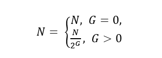

## 共识机制

区块链系统可以分为公有链、联盟链和私有链。本文提出的共识机制属于联盟链中的授权共识机制。

授权共识机制主要由节点、节点合约、区块、区块推荐和标记、投票机制组成。

### 节点

针对系统的特定运作方式和不同的使用场景，本文提出了两种节点和两种用户，两种节点为主节点和简单节点,加入众生之链系统授权网络的节点称为主节点，仅完成数据同步，没有加入授权网络的节点成为简单节点；两种用户为节点用户和普通用户，在节点上登录，负责节点生成和验证签名的用户称为节点用户，仅用作在线记录“生命”，参与投票的用户称为普通用户。

主节点拥有区块的读写权限、发起投票权限和监督审核其他主节点权限（包括审核主节点加入请求、发起删除主节点的请求、审核删除主节点的请求等）。简单节点仅有拥有区块的读权限。任何节点初始化时都必须注册或登录用户，以便能生成和验证签名。

主节点面向普通用户提供多种必要的服务，是众生之链系统运行的重要组成部分，是用户与众生之链系统沟通的关键桥梁。

主节点必须提供给用户的服务有：
1. 用户记录“生命”的服务平台，且保证24小时不间断运行。 
2. 用户查询短期票、长期票的平台，包含已使用票数和剩余票数。 
3. 正在推荐或正在标记的众生区块ID列表。 
4. 用户投票服务。

主节点用户还必须完成以下工作：
1. 挑选用户提交的优秀"生命"记录，并在共识机制规定的恰当时期将其作为区块体生成众生区块。 
2. 挑选拥有人们共同记忆的众生区块，并向公众公布，为用户投票做准备。 
3. 审查不符合社区规范的众生区块，并向公众公布，为用户投票做准备。 
4. 计算所有用户的短期票、长期票和惩罚票等信息。

### 节点合约
主节点加入。在一台具有公网固定IP的服务器上，部署系统并且同步完成数据之后，即可成为简单节点。在此基础上，提交加入主节点申请书并且有超过50%（含50%）的主节点同意之后，即可成为主节点。若有一个简单节点申请成为主节点，首先需要在一个主节点提供的页面或接口处进行申请，在取得当前主节点的同意之后，由当前主节点将申请书广播给其他主节点，并且维护其他主节点发来的同意或拒绝消息。当收集的同意消息数量在共识机制规定的时间内，超过总主节点的50%（含50%）后，即可向全网广播新节点确认加入消息；当超过共识机制规定的时间，则当前主节点不再维护本次申请消息。
加入主节点的申请书有效时间为432000.000秒。

主节点被动退出。在众生区块生成的过程中，若某主节点A未能按照预期，在规定时间内产生区块或广播不产生区块的消息，则认为主节点A已经违规离线，其他主节点将在短期内自动达成共识，将主节点A删除。

主节点主动退出。任何阶段，若有任意主节点认为某主节点B违反了社区条约，即可向全网广播删除B的申请书。若在共识机制规定时间内，有超过50%（含50%）的主节点同意之后，即广播确认删除主节点B的消息，若超过共识机制规定的时间，则本次申请失败。
主动申请删除主节点的申请书有效时间为432000.000秒。

### 众生区块

众生区块的生成周期为一分钟，每周期N个主节点各生成一个众生区块，共N个区块。每个周期分为三个阶段，第一个阶段目的是生成区块，第二个阶段目的是检测是否收集到当前周期产生的所有区块，第三个阶段是，若未收集完全，则进行数据恢复。

N的计算方式：当主节点数量（P）小于等于20时，N等于2；当主节点数量(P)大于20时，N的等于主节点数量除以10并向下取整。

产生区块的主节点选取规则为：
1. 将所有主节点按照节点ID的字典顺序升序排列。 
2. 将上一众生区块生成周期生成的众生区块按照区块ID的字典顺序升序排列。 
3. 计算上一周期的最后一个区块的哈希值,哈希值的计算函数为SHA256。 
4. 拼接最后一个区块的哈希值和当前众生区块生成周期，并作为随机种子。 
5. 使用Mersenne Twister算法随机挑选N个主节点，并去重。

### 时代区块

时代区块用来推荐众生区块，其区块主体记录推荐的众生区块的ID和生成众生区块的公钥列表。如果众生区块记录的某个“生命”属于某些人们的共同记忆，那么，主节点用户可以推荐该众生区块，之后发动人们参与投票，当票数在规定时间达到一定条件，即可生成时代区块。众生区块被推荐为时代区块后，生成它的用户会被奖励。

生成时代区块的体规则如下：
1. 在一个选举周期之内，主节点推荐某众生区块A，并维护A的投票数据。用户检查票数，进行投票。
2. 若在规定时间内投票数量达到T,则广播确认生成众生区块；若超过规定时间则取消本次推荐。
3. 每个选举周期开始会清零上一周期所有投票数据，并重新计算每个用户的票数信息。

T为常数，T = 1024.0

### 垃圾标识区块

垃圾标注区块用来标注错误或恶意生成的众生区块，其区块主体包含标注的众生区块的ID和生成众生区块的公钥列表。众生区块被标注为垃圾区块后，生成它的用户将会受到一定惩罚, 且任何结点无需再保存该区块的区块体内容。

垃圾标注区块的生成机制和运作方式与时代区块类似。具体规则如下：
1. 在一个选举周期之内，主节点标记某众生区块B，并维护B的投票数据。用户检查剩余票数，进行投票。 
2. 若在共识机制规定的时间内，B的投票数量达到G,则广播确认生成垃圾标识区块的消息；若超过共识机制规定的时间，则取消本次标记。 
3. 每个选举周期开始会清零上一周期所有关于生成垃圾标识区块的投票数据，并重新计算每个用户的票数信息。

G为常数，G = 1024.0

### 投票机制

本文提出了三种不同类型的票，短期票、长期票和惩罚票。每种票的最小分隔值均为0.1票。每次投票的最小值为1.0票。所有票都将在选举周期开始时重新计算，并且当前选举周期获得的票将在下一个选举周期生效。

选举周期的有效时长为20160个众生区块生成周期。

#### 短期票
主节点每产生一个众生区块，则主节点用户获得1个短期票，主节点可将票的一部分的投票权授予做出一定贡献的普通用户。具体规则可由主节点自行设定，设置合适的授权策略可以激励用户更高质量地记录“生命”。
例如可以采用如下策略：每产生一个众生区块，主节点授予记录该众生区块的普通用户0.5短期票。

短期票有效期为8个选举周期。

#### 长期票
主节点每产生一个时代区块或垃圾区块，则主节点即可获得一个长期票。另外，时代区块推荐的众生区块中标识的主节点用户和普通用户都将获得1个长期票。

普通用户获得长期票不再依赖于主节点，可在任何主节点提供的投票平台处使用。

长期票有效期为128个选举周期。

#### 惩罚票
惩罚票为扣除性质的票，最多可将用户的票数扣除至0。对于主节点用户和普通用户，惩罚票有不同的作用机制。

主节点。主节点产生的众生区块每被标记为一个垃圾区块，则被扣除一定的票数。假设被标记了G个区块，则扣除D票。 

D的计算方式：D=8*(2^G-1) 

普通用户。普通用户记录的众生区块每被标记为一个垃圾区块，则普通用户的长期票数会被扣除50%并向下取整。假设被标记了G个区块，则普通用户剩余票数N的计算方式如：

惩罚票永久有效。

   

